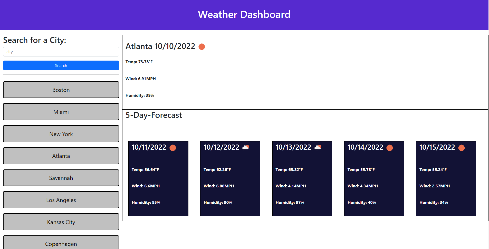

# Weather Dashboard!

This is an application to keep a log of your schedule during a work day.

[Deployed Application](https://dcrowdev.github.io/challenge06-weather-dashboard/)

## Description

This weather dashboard application shows you the current and five-day forecast for any city!  
Using the openweather API, it accesses a slew of data and this app displays some of that data.  

### Installing

No installation required! Application runs on browser.

### Executing program

Use the search bar to search for the city you want the weather report for!  
You can clear your history with the clear search history button.

## Authors

Dylan Crowley:

[Github](https://github.com/dcrowdev)  
[Twitter](https://twitter.com/dcrowdev)  
[LinkedIn](https://www.linkedin.com/in/dylan-crowley-3974b8252/)  
dcrowdev1025@gmail.com

## License

This project currently has no license.

## Acknowledgments

UCF Fullstack bootcamp!
